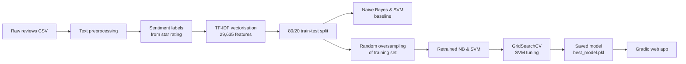

# 🎸 Sentiment Analysis of Musical Instrument Reviews


An end-to-end NLP project that classifies Amazon musical-instrument reviews as **positive**, **neutral** or **negative**. It covers text cleaning, TF-IDF feature extraction, Naive Bayes and SVM classifiers, handling a heavily imbalanced dataset, hyperparameter tuning, and an interactive **Gradio** web app for live predictions.

---

## 📑 Table of Contents
- [Overview](#-overview)
- [Dataset](#-dataset)
- [Project Pipeline](#-project-pipeline)
- [Results](#-results)
- [Key Findings](#-key-findings)
- [Project Structure](#-project-structure)
- [Getting Started](#-getting-started)
- [Limitations & Future Work](#-limitations--future-work)
- [Author](#-author)

---

## 🔍 Overview

Online reviews contain valuable signals about customer satisfaction, but reading thousands of them manually is impractical. This project builds a sentiment classifier that predicts the tone of a review from its text alone.

**Objectives**
- Clean and normalise raw review text for machine learning.
- Compare a probabilistic model (Multinomial Naive Bayes) with a margin-based model (Support Vector Machine).
- Diagnose and address **class imbalance**, which makes plain accuracy misleading.
- Deploy the model behind a simple web interface for real-time predictions.

**Tech stack:** Python · pandas · NumPy · NLTK · scikit-learn · imbalanced-learn · Matplotlib · Seaborn · Gradio · joblib

---

## 📊 Dataset

| Property | Value |
|---|---|
| File | `Musical_instruments_reviews.csv` |
| Source | Amazon product reviews — Musical Instruments category ([McAuley, UCSD](https://jmcauley.ucsd.edu/data/amazon/)) |
| Rows | 10,261 reviews |
| Columns | 9 (`reviewerID`, `asin`, `reviewerName`, `helpful`, `reviewText`, `overall`, `summary`, `unixReviewTime`, `reviewTime`) |
| Text used | `reviewText` (7 missing values filled with empty strings) |
| Target | Derived from the `overall` star rating |

**Sentiment labelling rule**

| Star rating | Label | Count | Share |
|---|---|---|---|
| 4 – 5 ★ | `positive` | 9,022 | 87.9% |
| 3 ★ | `neutral` | 772 | 7.5% |
| 1 – 2 ★ | `negative` | 467 | 4.6% |

> ⚠️ The dataset is **highly imbalanced** — almost 9 out of 10 reviews are positive. A model that always predicts "positive" already scores ~88% accuracy, so per-class metrics are essential.

---

## ⚙️ Project Pipeline



### 1. Text preprocessing
Each review is passed through a cleaning function:
1. Lowercasing
2. Punctuation removal
3. Tokenisation (`nltk.word_tokenize`)
4. English stop-word removal
5. Lemmatisation (`WordNetLemmatizer`)

### 2. Feature extraction
Cleaned text is converted into a sparse **TF-IDF** matrix of shape `(10,261 × 29,635)`.

### 3. Modelling
| Stage | Models | Notes |
|---|---|---|
| Baseline | `MultinomialNB`, `SVC(kernel="linear")` | Trained on the original (imbalanced) training split |
| Rebalanced | Same models | Training set oversampled with `RandomOverSampler` → 7,213 samples per class |
| Tuned | `SVC` via `GridSearchCV` | Grid: `C ∈ {0.1, 1, 10}`, `kernel ∈ {linear, rbf}`, `gamma ∈ {scale, auto}`; 5-fold `StratifiedKFold`; scoring = weighted F1. Best: `C=10, kernel=rbf, gamma=scale` |

### 4. Deployment
A **Gradio** interface takes a review as input, applies the same preprocessing and TF-IDF transform, and returns the predicted sentiment.

---

## 📈 Results

All results are on the same held-out **test set of 2,053 reviews** (1,809 positive · 140 neutral · 104 negative).

### Overall metrics (weighted averages)

| Model | Accuracy | Precision | Recall | F1 (weighted) | F1 (macro)* |
|---|---|---|---|---|---|
| Naive Bayes — baseline | 0.881 | 0.776 | 0.881 | 0.826 | — |
| Linear SVM — baseline | 0.884 | 0.897 | 0.884 | 0.831 | 0.34 |
| Naive Bayes — oversampled | 0.759 | 0.859 | 0.759 | 0.798 | — |
| **Linear SVM — oversampled** | 0.833 | 0.844 | 0.833 | **0.836** | **0.48** |
| RBF SVM — oversampled + tuned | 0.884 | 0.864 | 0.884 | 0.832 | 0.35 |

<sub>*Macro F1 (the unweighted average across the three classes) is calculated from the confusion matrices below. It gives the minority classes equal weight, so it is the fairest single number for this dataset.</sub>

### Minority-class recall (how many neutral / negative reviews were actually caught)

| Model | Neutral recall | Negative recall |
|---|---|---|
| Linear SVM — baseline | 1.4% (2 / 140) | 2.9% (3 / 104) |
| **Linear SVM — oversampled** | **27.1% (38 / 140)** | **23.1% (24 / 104)** |
| RBF SVM — oversampled + tuned | 1.4% (2 / 140) | 3.8% (4 / 104) |

### Confusion matrices

| Linear SVM — baseline | Linear SVM — oversampled | RBF SVM — tuned |
|---|---|---|
|  |  |  |

---

## 💡 Key Findings

1. **High accuracy hid a poor model.** The baseline models reach ~88% accuracy, which is almost exactly the share of positive reviews. The confusion matrix shows the SVM labels nearly every review as positive and catches only 5 of 244 neutral/negative reviews. Manual testing in the Gradio app confirmed this bias.
2. **Oversampling helped the minority classes the most.** Rebalancing the training data lowered accuracy (88.4% → 83.3%) but raised the weighted F1 to 0.836 and raised macro F1 from 0.34 to 0.48. Neutral recall rose from 1% to 27% and negative recall from 3% to 23%. This is the most useful model in the project.
3. **Hyperparameter tuning overfit.** The grid search reported a near-perfect cross-validation F1 of **0.9996**, but test performance fell back to baseline behaviour. Oversampling happened *before* cross-validation, so duplicated minority reviews appeared in both training and validation folds. The tuned RBF SVM learned to memorise them rather than generalise.
4. **Neutral reviews are the hardest class.** Three-star reviews often mix praise and complaints ("good sound, but the strap broke"), so their vocabulary overlaps heavily with both other classes.

---


## 🚀 Getting Started

### Prerequisites
- Python 3.11 (developed with 3.11.8)
- Jupyter Notebook or JupyterLab

### Installation

```bash
# Clone the repository
git clone https://github.com/Sirajul-Islam6335/music_instrument_review.git
cd music_instrument_review

# (Optional) create a virtual environment
python -m venv venv
source venv/bin/activate        # Windows: venv\Scripts\activate

# Install dependencies
pip install numpy pandas nltk scikit-learn==1.7.2 imbalanced-learn matplotlib seaborn gradio joblib
```

> The saved `.pkl` files were created with **scikit-learn 1.7.2**. Loading them with a different version may raise warnings or errors.

### Run the notebook

```bash
jupyter notebook "music_instruments_review -f.ipynb"
```

Run the cells from top to bottom. The notebook downloads the required NLTK data (`punkt`, `punkt_tab`, `stopwords`, `wordnet`) automatically. The final cells launch the Gradio app at `http://127.0.0.1:7860`.

> **Note:** `best_model.pkl` contains only the classifier, **not** the fitted `TfidfVectorizer` or the preprocessing function. To predict on new text you must run the notebook up to the TF-IDF step first. See *Future Work* below.

---

## 🧭 Limitations & Future Work

**Current limitations**
- **Data leakage in tuning:** oversampling before `GridSearchCV` inflates cross-validation scores.
- **Vectoriser fitted on the full dataset:** `TfidfVectorizer` is fitted before the train/test split, so test-set vocabulary leaks into training.
- **Model not self-contained:** the vectoriser is not saved alongside the classifier.
- **Minority-class performance is still modest** (macro F1 ≈ 0.48).

**Planned improvements**
- [ ] Wrap preprocessing, TF-IDF and the classifier in a single `imblearn.pipeline.Pipeline`, so oversampling happens *inside* each CV fold and the whole pipeline can be saved as one file.
- [ ] Tune with **macro F1** instead of weighted F1 to prioritise the minority classes.
- [ ] Try `class_weight="balanced"`, SMOTE, or undersampling as alternatives to random oversampling.
- [ ] Add n-grams (`ngram_range=(1, 2)`) so the model can capture phrases such as "not good".
- [ ] Keep negation words (e.g. *not*, *no*), which are currently removed as stop words.
- [ ] Experiment with transformer models (e.g. DistilBERT) for better handling of mixed and neutral reviews.
- [ ] Deploy the Gradio app to **Hugging Face Spaces** for a public demo.
- [ ] Add a `requirements.txt` and a standalone `app.py`.

---

## 👤 Author

**Sirajul Islam**
- GitHub: [@Sirajul-Islam6335](https://github.com/Sirajul-Islam6335)

---

## 🙏 Acknowledgements
- Review data from the Amazon product data collection by Julian McAuley, UC San Diego.
- Built with [scikit-learn](https://scikit-learn.org/), [NLTK](https://www.nltk.org/), [imbalanced-learn](https://imbalanced-learn.org/) and [Gradio](https://www.gradio.app/).

⭐ If you found this project useful, consider giving the repository a star!
